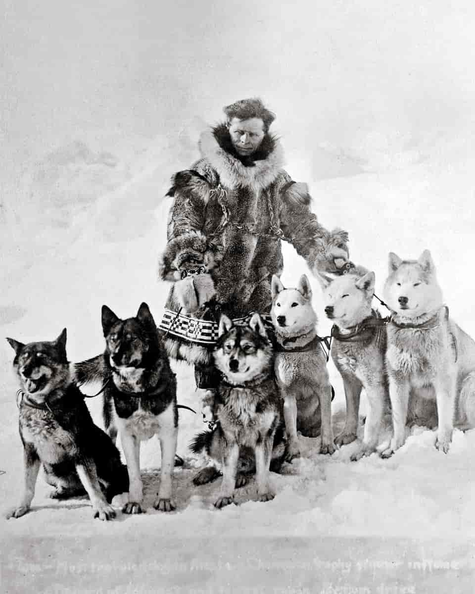

---

permalink: siperianhusky-elokuvat
title: Siperianhusky julkisuudessa
description: Siperianhuskyt ovat tosielämän sankareita, mutta ne ovat myös esiintyneet useissa elokuvissa ja tv-sarjoissa
menu: 

image: 
layout: artikkeli

linkin-pikkukuva: square-125x125-image-name.jpg
linkin-teksti: näkyy linkin vieressä

---

Eräs tunnetuimmista rodun muistomerkeistä on vuodesta 1925 New Yorkin Keskuspuistossa ollut pronssinen Balton patsas. Balto sai suurimman kunnian seerumiajosta, koska sen johtama valjakko saapui Nomeen, vaikka Seppalan koirat johtajanaan Togo kulkivat pisimmän osan matkasta.

*Seppala koiriensa kanssa. Vasemmalta oikealle: Togo, Karinsky, Jafet, Pete, - , Fritz*

## Elokuvat ja TV

**Elokuva- ja TV-hahmoja** ovat mm. elokuvan Eight below (Seikkailu Etelänavalla) Max, Maya, Truman, Old Jack, Dewey ja Shorty (ilmestyi v. 2006). Ko. elokuvaan oli päärooliin ehdolla Troika´s Carbon Copy, suomalaisittain Hauva. Hauvan ostivat Hollywoodiin eläinkouluttajat, ja siitä piti tulla pääosan esittäjä, mutta Hauva oli jo 6-vuotias ja ollut vain kotikennelissään Teksasissa. Sitä pelottivat kokemattomuuttaan valtavat turbiinit, jotka tekivät lumimyrskyn kaltaista säätä, ja kouluttajat palauttivat sen kotikenneliin. Sieltä se löysi tiensä Kuuhaukun kenneliin loppuelämän eläkekodiksi. Hauva oli oppinut jo kuitenkin muutamia asioita ollessaan Hollywoodissa ja oli hauska huomata, miten se esimerkiksi veti köydestä jäihin pudonneen ihmisen ”maalle” –siis alkoi vetää köydestä sellaisen nähdessään. Elokuvan Truman oli ostettu myös Troikas-kennelistä, mistä Kuuhaukkuun on tullut useita tuonteja.

Disneyn Iron Will v. 1994 (Lumikenttien sankari) kertoo nuoren pojan valjakkokilpa-ajosta Alaskassa. Johtajakoirana oli valkoinen sinisilmäinen siperianhusky, mikä nostatti pentubuumin valkoisissa rodun edustajissa.

Snow dogs (Lumihauvat), niinikään Disneyn elokuva, ilmestyi 2002. Komediallisessa elokuvassa johtajakoirana on Demon, sama koira, joka myöhemmin näytteli Eight belowssa, koska Troika´s Carbon Copya ei voitu käyttää.

TV-sarja Game of Thrones sai aikaan sen, että siperianhuskysta tuli muotirotu, ja sen seurauksena rescue-kodit täyttyivät siperianhuskeista. Niin kävi, vaikka sarjassa ei käytetty edes oikeita siperianhuskeja vaan koiria, jotka vain näyttivät niiltä.

Snow Buddies (Pentujengi Alaskassa) –elokuvassa (ilmestyi 2008) pääosassa on persoonallinen mustavalkoinen sinisilmäinen siperianhusky-pentu (äänenä Dylan Sprouse).

2019 ilmestyi elokuva Togo, joka kertoi melko mukaillusti Leonhard Seppalan johtajakoiran tarinan seerumiajo taustana.

TV-ohjelmassa Parks and Recreation esiiintyy siperianhusky ”henkioppaana” April Ludgatelle.

Due south (Chigagon ratsupoliisi) –tv-sarjassa useat puhdasrotuiset siperianhuskyt esittivät Diefenbakeria, konstaapeli Fraserin puolisusi-lemmikkiä.

## Animaatioissa

Paw Patrolissa Everest-koira on siperianhusky. Road rovers (Rooverit) –sarjassa yksi hahmoista on Exile-niminen siperianhusky.

Useissa ohjelmissa on voinut myös nähdä siperianhuskien (tai niiden risteytysten) esittävän sutta arktisen ja alkukantaisen ulkonäkönsä vuoksi.

