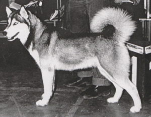
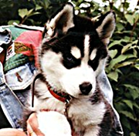
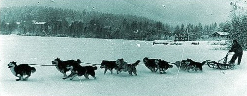
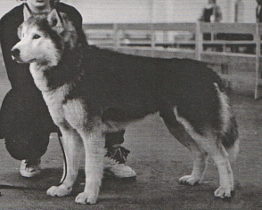
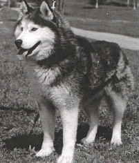
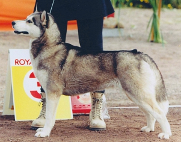
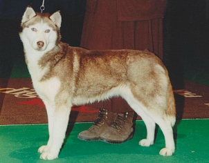

Kuuhaukun kennel was founded in 1979. The kennel's foundation bitch was **SE & FIN CH
V-86 Roady Ratiritiralla**. She is the basis for 9 generations of breeding work. 

Her sire **FIN CH Äijänsuon Tantintin** is a direct descendent of American Old Line® siberian huskies. Her maternal grandfather was **CH Monadnock´s Papik of Mekusak**. (*CH Monadnock´s Akela x Monadnock´s Natasha; Monadnock kennel was one of the most significant Old Line® kennels*). He was imported from USA by Finnish Mekusak kennel.

**FIN MVA Äijänsuon Tantintin**'s maternal grandfather was was an import, **C.I.B & POHJ MVA Norrstar´s Baanchi**, who occurs many times in the pedigrees of Kuuhaukun kennel. At the age of ten, Baanchi was still working, like its ancestor **Togo** (from nine generations back), the lead dog of the famous Leonhard Seppala. 

Tantintin's sire was Natomah´s Ruff-n-Reddi, whose father was the famous **CH Mikiuk Tuktu Tornayak**, one of Seppala's last dogs rescued by Jeffrey Bragg.

**Alaskan´s Victor of Anadyr** was imported in 1970's directly from Alaskan's Kennel (in Alaska) to Äijänsuon kennel. He spent the rest of his life in Kuuhaukun kennel and his effect can be seen in Kuuhaukun pedigrees. He was a lead dog like many of his offspring.

&nbsp;&nbsp;&nbsp;&nbsp;
&nbsp;&nbsp;&nbsp; 
Founding bitch SE & FIN CH V-86 Roady Ratiritiralla and a typical Kuuhaukun puppy
 
View the pedigree of [SE & FIN CH V-86 Roady Ratiritiralla](https://jalostus.kennelliitto.fi/frmKoira.aspx?RekNo=SF222344/78&R=270)
to see that her descendents represent ideal old line siberian huskies. This is the foundation of Kuuhaukun kennel.

The dogs at Kuuhaukun kennel work in a sled team every week (not for competition purposes), and their work in the team is taken into account in breeding work. Our principle is that the trekking performance reflects the original use of Siberian Husky rather than speed racing. Dogs are purposefully trained for longer sleigh rides during the rest of the season.

**Descendants of Kuuhaukun Ikuinen Rakkaus**, Rascal (3 x CAC), has run the 1770 km
[Iditarod](https://iditarod.com/) competition in Alaska. Rascal's descendants have competed in the United States, Canada and Austria, usually in long-distance competitions. Jade's (import from the Troika kennel) descendants have competed in Austria, France and Germany. Rascal's son **AUT CH Troika´s Nordic Legend**, who lives in Austria is Austrian CH and a lead dog. He is also the sire of a litter with **Kuuhaukun Dominoa Lumella** (Peppi).

 
Mauri Sirén riding a sledge with Äijänsuon kennel's team in 1970's'

 

#### SUCCESS IN SHOWS

The Siberian Huskies at Kuuhaukun kennel have been successful in shows for years. They have achieved several winning titles. The second litter from Kuuhaukun kennel gave birth to  **IT MVA Kuuhaukun Finn-Aslak**, who was exported to Italy and became a youth world winner in 1983. One of Kuuhaukun show stars is **V-97-98 Kuuhaukun Ikijään Punapeto** (9 certificates), who also has group and BIS placements. Also **V-01 -02 Kuuhaukun Luminan Uni** has followed her dam Ikijään Punapedo on the show track. Kuuhaukun kennel has 19 championships required 3 CAC winning dogs (2016).

&nbsp;&nbsp;&nbsp;&nbsp;&nbsp;&nbsp;&nbsp;
 
V-85-88, PMV-89 Kuuhaukun Reissumies (5 CACs) and import Fjiorlund's Northern-Tok (8 CACs).

 

Also the following dogs have had success in exhibitions:  **V-85-88, PMV-89 Kuuhaukun Reissumies**, **V-97-98 Kuuhaukun Ikijään Punapeto** (7 CAC & 9 CACIB),  
(5 CAC & 3 CACIB), **Kuuhaukun Hepsakka** (4 CAC & CACIB), **V-01 -02 Kuuhaukun Luminan Uni** (3 CAC & CACIB) and European Winners 1991, sisters **EUV-91 Kuuhaukun Don Carlos** and **EUV-91 Kuuhaukun Kesäyönunelma**, **VV-13 Kuuhaukun Teräs-Teddy** (2 CAC), and **JV-02 Kuuhaukun Onnettaren Oodi** (2 CAC),who was also an official search and rescue dog who passed the rescue dog test.

It should be mentioned that Old Line siberian huskies are suitable for many different purposes.  For example Hile, **Kuuhaukun Hallava Hauva**, is rally obedience champion, almost always finishing with full marks( 99/100 points, 1. position).

Several champions have been imported to Kuuhaukun kennel for retirement,  including **INT & USA CH Troika's Bright Coin** and Iditarod veteran **INT & USA CH Troika's 
Nordic Icon SD** (who descends from Kuuhaukun Ikuinen Rakkaus).

&nbsp;&nbsp;&nbsp;&nbsp;&nbsp;&nbsp;&nbsp;
 
V-01 -02 Kuuhaukun Luminan Uni and her dam V-97-98 Kuuhaukun Ikijään Punapeto

 

However, the success or failure of the show has never affected the breeding choices of Kuuhaukun kennel. 

**The goal has always been to retain the original Old Line® Siberian Husky - a sled dog, not an exhibition ideal.**  

For this reason, not many old line siberian huskies have been seen in the exhibitions since the show line siberian huskies landed in Finland in the early 21st century. 

However in 2016 **Kuuhaukun Velhon Loitsu** won a **FIN CH EE CH**. He is also a lead dog.

#### LONG TERM BREEDING WORK

I have bred Old Line® Siberian Huskies at Kuuhaukun Kennel for over 40 years.
The first siberian husky "Ready" was born in 1978 and the first litter of Kuuhaukun kennel was born in 1980.

#### DOGS AT HOME

Dogs live in an outdoor kennel where they have the opportunity
to get inside the kennel building whenever you want. The kennel building also has
heated whelping room where puppies are born and raised. The whelping room has surveillance cameras, which can also be used to monitor the condition of the puppies and the mother remotely. Outside the kennel dogs get exercise in a large fenced running garden at the edge of the forest. Dogs pull a sledge weekly, in the summer heat we also go on swimming trips with the whole pack. Even obedience is practiced as Old Line® siberian huskies are docile. Our dogs are dear family members, only very few exceptional cases are  passed on as adults.

My oldest dogs have lived to be 17 years old.