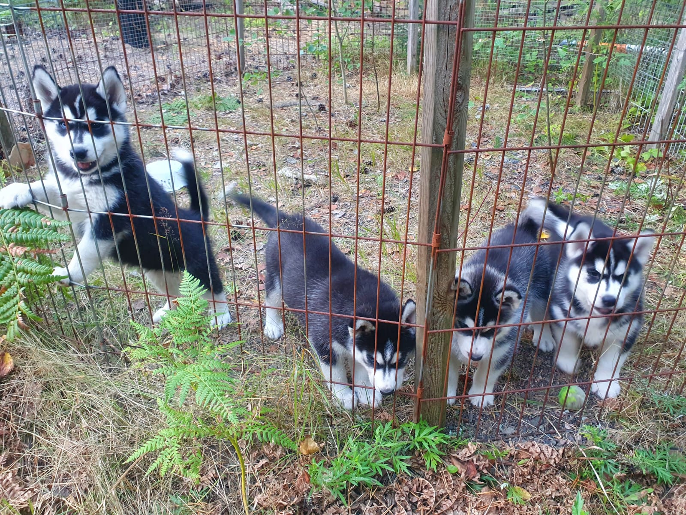
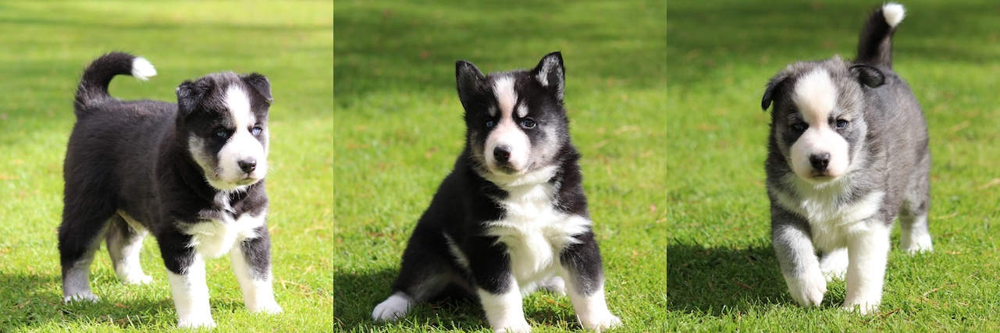
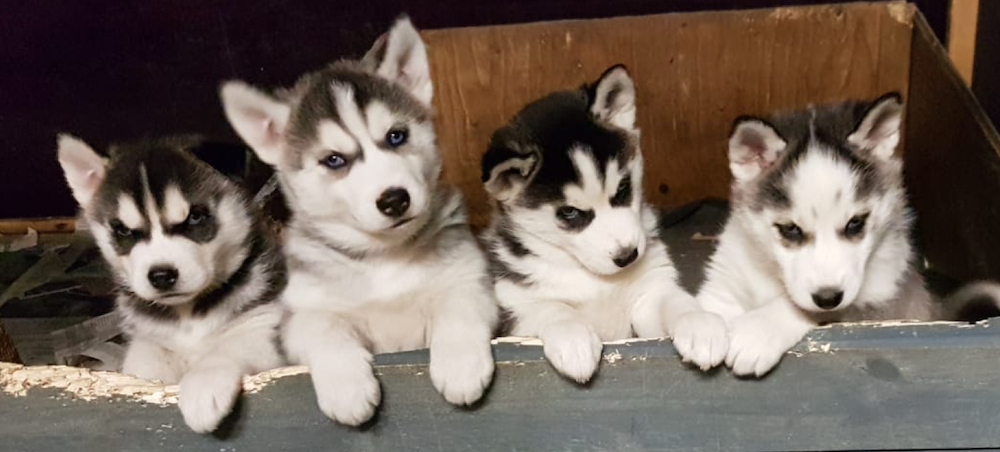

Tässä tämän vuoden Kuuhaukun kullannuput, pentue joka syntyi heinäkuussa 2022. 
Pentuja suunnitteilla puolen vuoden sisällä, [kysy lisää](yhteystiedot). 

### Pentuja vapaana

 
Oldline- pentuja, s. 10.8., kolme urosta. Tsuktsi-husky - yhdistelmä. 
Vain hyvään ja vastuuntuntoiseen kotiin, oldline- koirissa suljettu jalostus 

Tied. Hannu Häkkilä p. 0407621396

---

## Aiempia pentueita

*Kuvassa lokakuun 2020 old line pentuja*

Vuoden ensimmäinen old line® pentue on jo syntynyt! Kuuhaukun kennel on saattanut maailmaan jo yli 100 old line® pentuetta ja viimeisin syntyi 1.1.2021. 

Kaikki tämän pentueen pennut ovat varattuja. 

Myöhemmistä vuoden 2021 old line huskypentueista on nyt mahdollista varata pentuja. Tule tutustumaan aikuisiin koiriin Kuuhaukun kenneliin, niin kuulet lisää.  

<a href="http://siperianhusky.net/" target="_blank" style="color:rgba(0,0,0,0);">siperianhusky</a>

