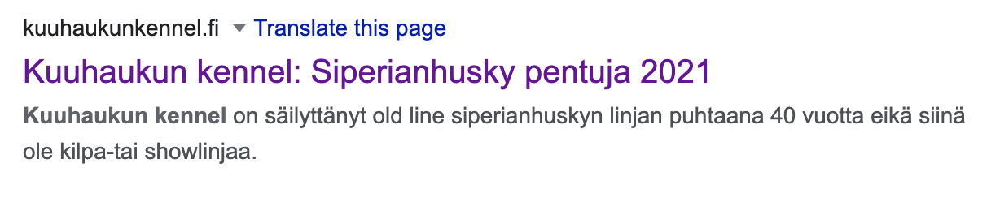
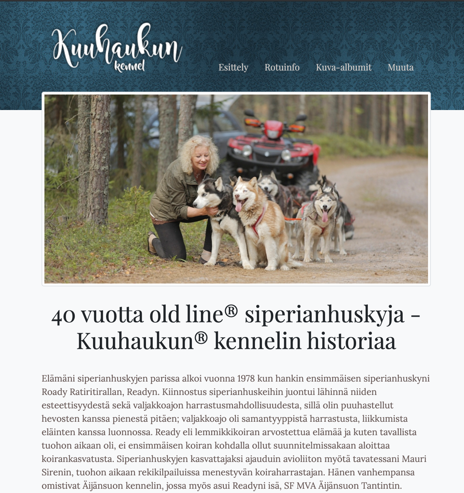
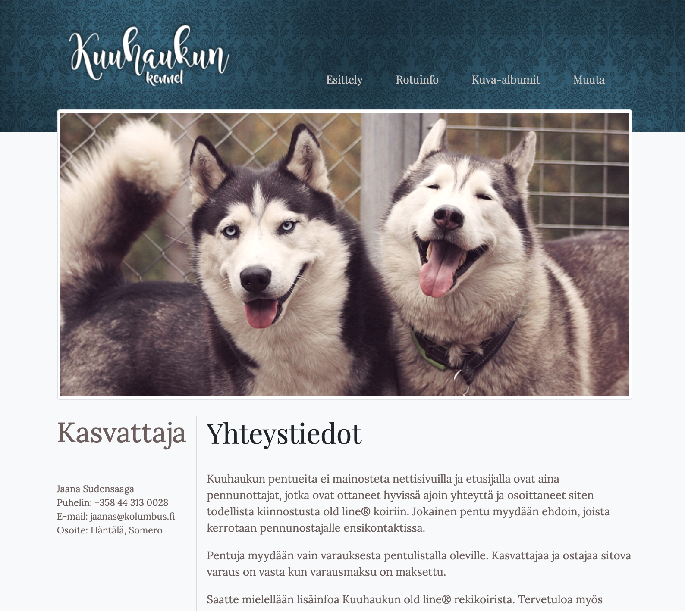
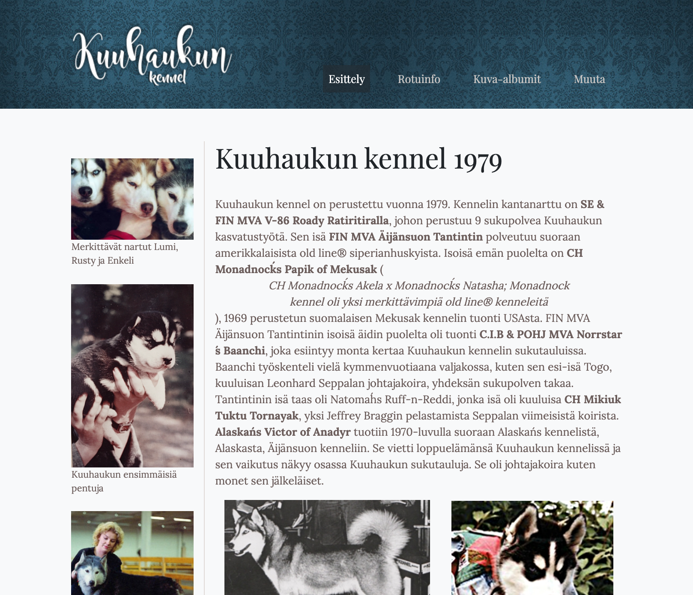
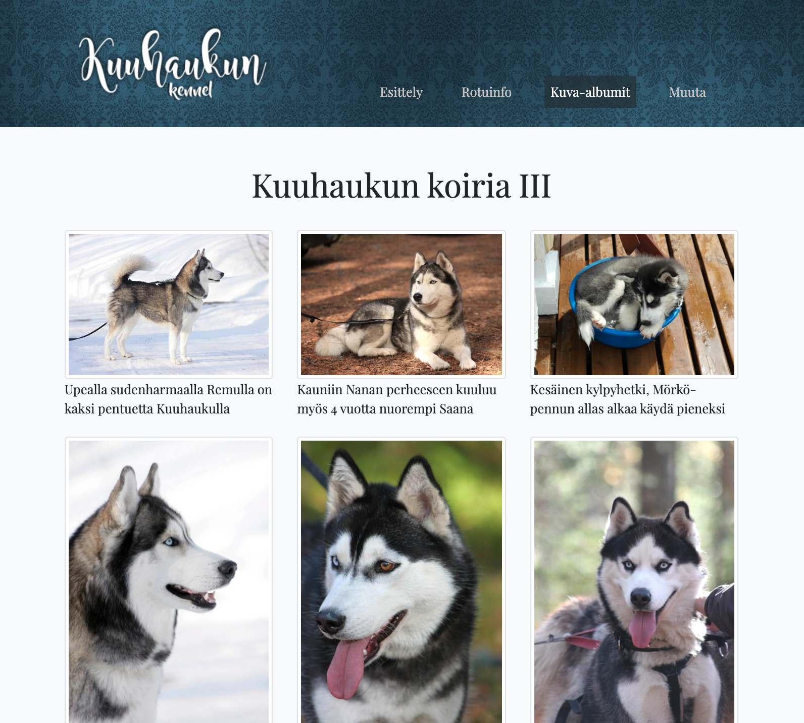
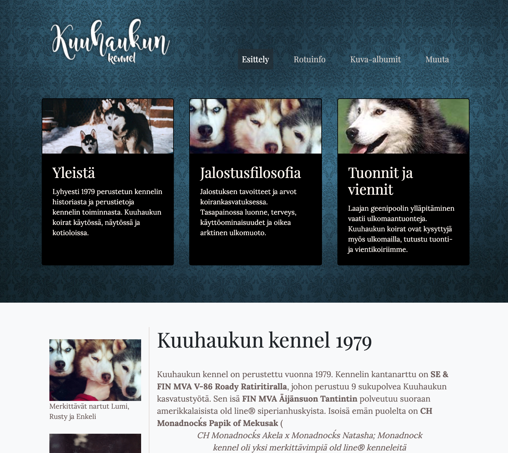

# How to add a new article

[1. Start with a template](#start-with-a-template)

[2. Fill in the frontmatter](#fill-in-the-frontmatter)

[3. Write the article content](#write-the-article-content)

## Start with a template

Go to the [_drafts directory](../_drafts) and duplicate one of the document templates that you can find there.

If you're writing in finnish, duplicate [_mallipohja.md](../_drafts/_mallipohja.md). 

If you're writing in english, duplicate [_template.md](../_drafts/_template.md).

Rename the file to match the URL that you want set for the final article. When in doubt, take a look at the file names of the existing articles. The name does not actually set the URL (`permalink:` variable does), but it's easier to find and edit the right files when the id's match.

## Fill in the frontmatter

There is a control section in the beginning of the file that defines how the article looks. It's called *frontmatter*. 

Let's fill it out using the instructions below.

### Basic information

| Variable       | Purpose                                                      |
| -------------- | ------------------------------------------------------------ |
| `permalink:`   | The URL of article, omit the domain name. For example, if the final URL is **www.siperianhusky.com/siperianhuskyn-historia**, the permalink would be **siperianhuskyn-historia**. Do not use white spaces or special characters like ä or ö here |
| `title:`       | The main title (H1) for the article. Also visible in Google seach results and in the browser tab leaf |
| `description:` | Search engine description for the page. Use relevant keywords and limit to 150 characters. This text shows under the headline in Google search results, like shown below |
|                |             |
| `image:`       | Optional. Image that's visible in Google search results. It's also shown if someone links to the article from Facebook or other social media |

### Selecting how the article looks like

Variable `layout:` selects the how the article will look like.

The layouts are defined in [_layouts](../_layouts) directory and we currently have the following layouts.

|       Layout       | Description |
| :----------------------: | ------------------------------------------------------------ |
|      `artikkeli`                     |       One-column article. You can have a big header image or start with plain text and include images in the article itself.                                                         |
| `artikkeli-tekstipalkilla` | Two-column article where the left column contains just text. You can have a big header image or start with plain text and include images in the article itself.   |
| `artikkeli-kuvapalkilla` | Two-column article where the left column is reserved for images. **Please note!** In mobile the images will appear as a full width image gallery under the article.   |
| `kuvagalleria` | A gallery page   |
| `menusivu` | Upper level subpage with highlights section and plain article. |
| `menusivu-kuvapalkkiartikkelilla` | Two-column article with images, just like `artikkeli-kuvapalkilla`, but it appears as an upper level subpage with highlights section.  |
| `menusivu-vain-linkit` | Upper level subpage with highlights section and links gallery. |

### Set the variables that the layout needs

This section is still under work. For now, it's just best to find an existing article with the same layout and look at how the variables are filled there.

| Variable              | Purpose                                                      |
| --------------------- | ------------------------------------------------------------ |
| `menu:`               |                                                              |
| `linkin-pikkukuva:`   |                                                              |
| `linkin-teksti:`      |                                                              |
| `kolme-esiin-title:`  |                                                              |
| `kolme-esiin-teksti:` |                                                              |
| `kolme-esiin-kuva:`   |                                                              |
| `sivukuvat:`          |                                                              |

### Linking article to old content

For the article to be found by people who browse the site, it must be linked to existing content somehow.

There are 2 ways to do that, by adding article into a menu and by linking to it from another article.

## Write the article content

The article content is written under the control section. It looks like there's no formatting, but actually there is. The content is written in markdown language. 

 [Markdown cheat sheet](https://www.markdownguide.org/cheat-sheet/)

